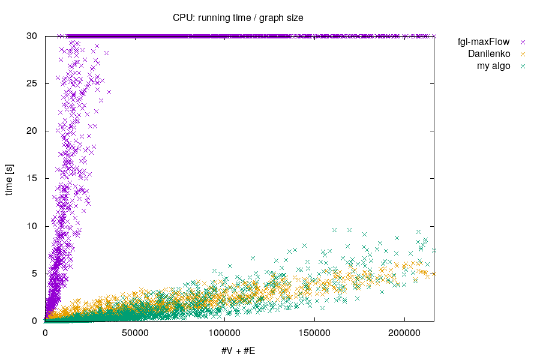
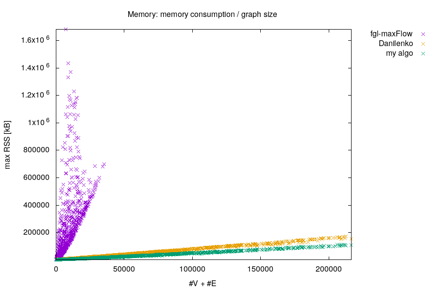
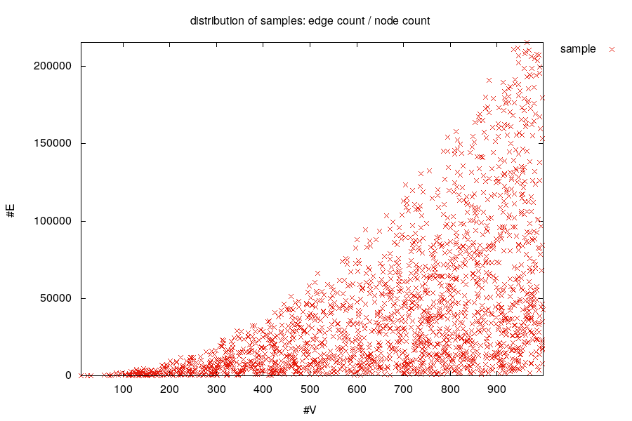
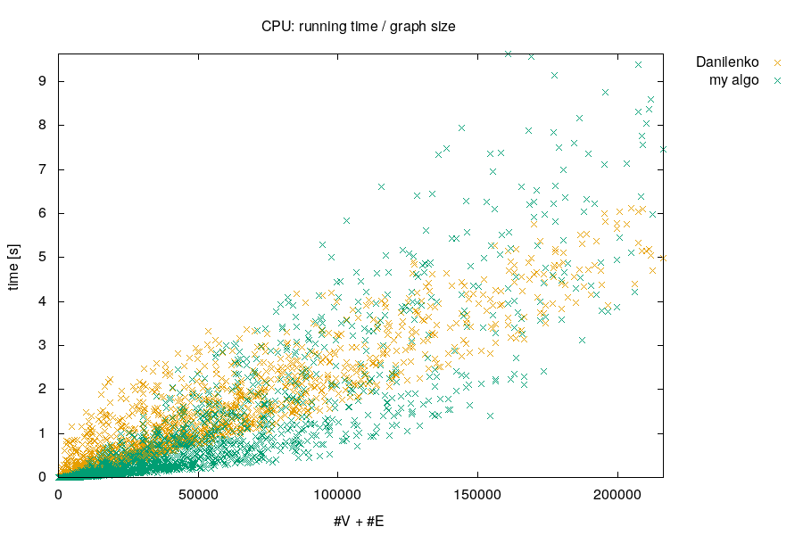
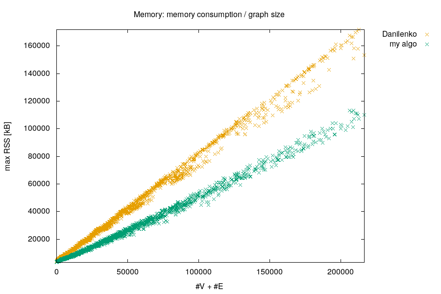

Maximum Cardinality Bipartite Matching 
======================================

Synopsis
--------

A somewhat efficient, purely functional (Haskell) algorithm to find
maximum cardinality matchings in bipartite graphs
([MCBM](https://en.wikipedia.org/wiki/Maximum_flow_problem#Maximum_cardinality_bipartite_matching)).

This project contains a library, command line tool, tests and
benchmark.

Usage
-----

Module `Data.Graph.MaxBipartiteMatching` exports the function

    matching :: (Ord a, Ord b) => S.Set (a,b) -> M.Map b a

which calculates a maximum cardinality matching on the given bipartite
graph.  It directly works on `Data.Set.Set`s of pairs, and returns a
backward mapping as `Data.Map.Strict.Map`.

    > matching $ fromList [(1,'a'),(1,'b'),(2,'a'),(2,'c'),(3,'b')]
    fromList [('a',1),('b',3),('c',2)]

The small command line tool [`matcher`](./src/Matcher.lhs)
demonstrates the use of the matching library.  See [build
instructions](./INSTALL) for more.

Performance & Testing
---------------------

The implementation is quite compact with the core functions accounting
for only 21 lines.  The [source
file](./src/Data/Graph/MaxBipartiteMatching.lhs) contains extensive
information about the workings of the algorithm.  There is no
correctness proof, but a [test suite](./INSTALL) is available.

    $ sed -rn '/\{-/,/-\}/d; /^>/p' src/Data/Graph/MaxBipartiteMatching.lhs | wc -l
    25

Despite its brevity it seems rather efficient.

There are very few other purely functional MCBM implementations
around.  AFAIK there is none in
[FGL](http://hackage.haskell.org/package/fgl) (June 2016), but they
have a MaxFlow algorithm which is a much more general approach of
course.  However, if you only need MCBM, then my implementation
scales better than using FGL.

*Update:* Recently I came across an
[implementation](http://www.rpe.informatik.uni-kiel.de/de/rechnergestutzte-programmentwicklung/dateien/nda/fbm.pdf)
by Nikita Danilenko: While my algorithm uses slightly less memory, CPU
usage is more dispersed with larger graphs.  For graphs in the region
50k < #V + #E < 150k, both implementations are on par, for smaller
graphs mine is faster, for larger graphs Danilenko's implementation
has a more reliable, and with increasing size better, runtime
complexity.

For better comparison, the same plots without showing th FGL results:

Scripts to [run the comparison](./INSTALL) are contained in this
repository, except that I do not distribute Danilenko's code.

Bugs
----

See the `BUGS/open` subdirectory.

History
-------

The implementation was [originally announced](./HISTORY) on Mon, 22
Oct 2012 on the `haskell-cafe` at `haskell.org` mailing list.  Since
then I use this toy project to play with other tools, e.g., GitHub.
