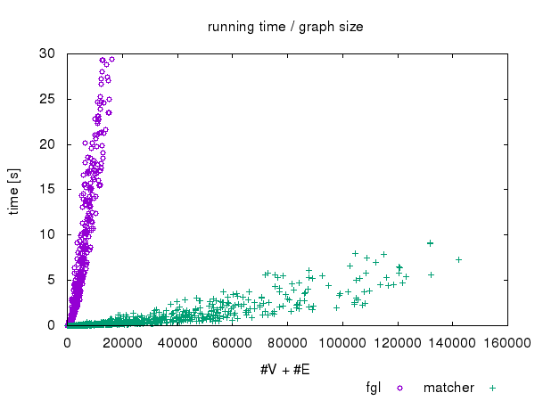
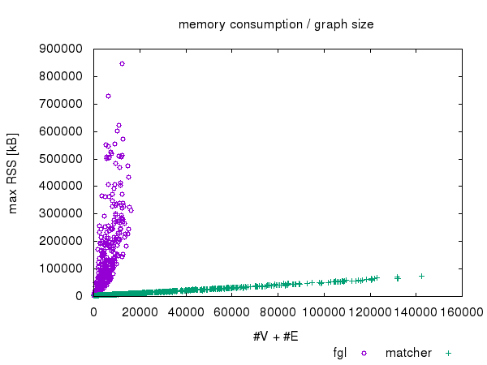
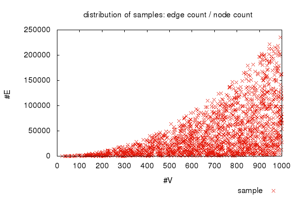

Maximum Cardinality Bipartite Matching 
======================================

Synopsis
--------

A somewhat efficient, purely functional (Haskell) algorithm to find
maximum cardinality matchings in bipartite graphs
([MCBM](https://en.wikipedia.org/wiki/Maximum_flow_problem#Maximum_cardinality_bipartite_matching)).

This project contains a library, command line tool, tests and
benchmark.

Use
---

Module `Data.Graph.MaxBipartiteMatching` exports the function

    matching :: (Ord a, Ord b) => S.Set (a,b) -> M.Map b a

which calculates a maximum cardinality matching on the given bipartite
graph.

The small command line tool [`matcher`](./src/Matcher.lhs)
demonstrates the use of the matching library.  See [build
instructions](./INSTALL) for more.

Performance & Testing
---------------------

The implementation is quite compact with the core functions accounting
for only 21 lines.  The source file contains extensive information
about the workings of the algorithm.  There is no correctness proof,
but a [test suite](./INSTALL) is available.

    $ grep -Ec '^>' src/Data/Graph/MaxBipartiteMatching.lhs
    25

Despite its brevity it seems rather efficient.  There are very few
other purely functional MCBM implementations around.  AFAIK there is
none in [FGL](http://hackage.haskell.org/package/fgl) (June 2016), but
they have a MaxFlow algorithm which is a much more general approach of
course.  However, if you only need MCBM, then this implementation
scales better than using FGL:

Scripts to [run the comparison](./INSTALL) are contained in this
repository.

Bugs
----

See the `BUGS/open` subdirectory.

History
-------

The implementation was [originally announced](./HISTORY) on Mon, 22
Oct 2012 on the `haskell-cafe!haskell.org` mailing list.  Since then
I use this toy project to play with other tools in, e.g., GitHub.
